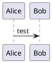

# Plantuml Markdown

This is very first Plantuml Markdown file (.wsd,.pu,.puml,.plantuml,.iuml)

```plantumlcode
@startuml
Alice -> Bob:test
@enduml
```


```plantuml
@startuml
Alice -> Bob:test
@enduml
```